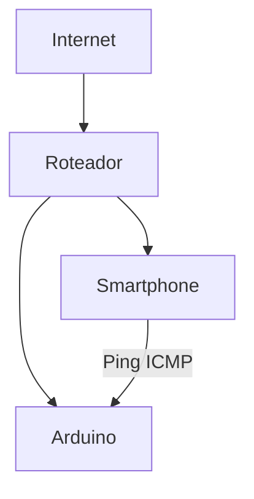
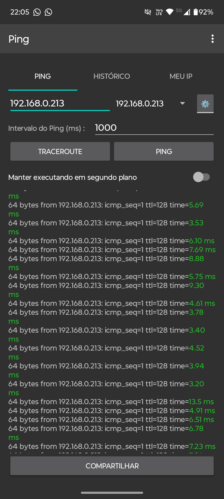

# IoT-Internet-das-Coisas

Alunos: Sara Oliveria, Nicolas Lopes e Anna Júlia

Professor: José de Assis

Data: 17/03/2026

---

# IoT com Arduino Ethernet - Monitoramento de Rede

Projeto de Internet das Coisas (IoT) utilizando Arduino com Ethernet Shield para comunicação em rede local e testes de conectividade.

---

## Objetivo:

Estabelecer comunicação entre um dispositivo Arduino e a rede local, permitindo:

- Obter endereço IP
- Responder requisições HTTP
- Validar conectividade via Ping

---

## Componentes Utilizados:

- Arduino UNO  
- Ethernet Shield (W5100)  
- Roteador  
- 2 Cabos Ethernet  
- Smartphone com aplicativo de Ping  

---

## Topologia da Rede:



---

## Configuração de Rede:

| Parâmetro  | Valor         |
| ---------- | ------------- |
| IP Arduino | 192.168.0.213 |
| Gateway    | 192.168.0.1   |
| Máscara    | 255.255.255.0 |

---

## Endereço MAC do Arduino:

Para que o Arduino com Ethernet Shield funcione corretamente na rede, é necessário definir um endereço MAC único.

Caso não saiba qual utilizar, você pode gerar um endereço válido através do site:

🔗 https://ssl.crox.net/arduinomac/

Após gerar, copie o MAC e utilize no seu código Arduino:

```cpp
byte mac[] = { 0xDE, 0xAD, 0xBE, 0xEF, 0xFE, 0xED };
```
---

## Testes Realizados:

Foi utilizado um aplicativo de ping para testar a comunicação:

- Respostas recebidas com sucesso  
- Latência média: **3ms ~ 13ms**  
- Comunicação estável  

---

## Segurança:

- Comunicação local sem autenticação  
- Dispositivo vulnerável se exposto (ex: DMZ)  
- Firewall do roteador controla acessos externos  

---

## Imagens do Projeto

<p align="center">
  <strong>Hardware:</strong><br><br>
  
</p>

<p align="center">
  <strong>Montagem (Fritzing):</strong><br><br>
  
</p>

<p align="center">
  <strong>Código em execução:</strong><br><br>
  
</p>

<p align="center">
  <strong>Teste de Ping:</strong><br><br>
  
</p>

---
<!--
## Melhorias Futuras

- Adicionar sensores IoT  
- Criar dashboard web  
- Implementar autenticação  
- Integração com API  
-->
---

## Servidor Web com Arduino

Foi implementado um servidor web utilizando o Arduino com Ethernet Shield, permitindo acessar uma página HTML diretamente pelo navegador.

---

## Desenvolvimento do Front-end

Foi criada uma página HTML simples para testes, utilizando:

- Estrutura básica em HTML5  
- Estilização com CSS  
- Testes locais com Live Server no VS Code  

### Estrutura do projeto local

/public_html
└── index.html

---

### Código HTML

```html
<!DOCTYPE html>
<html lang="pt-br">
<head>
    <meta charset="UTF-8">
    <meta name="viewport" content="width=device-width, initial-scale=1.0">
    <title>Arduino WEB Server</title>
    <style>
        body {
            background-color: #ebffec;
            font-family: sans-serif;
            text-align: center;
        }
    </style>
</head>
<body>
    <h1>Hello Arduino</h1>    
</body>
</html>
```

---

## Configuração do Servidor no Arduino

O HTML foi embarcado diretamente no código do Arduino utilizando `PROGMEM`, permitindo que o dispositivo funcione como um servidor web.

---

## Bibliotecas Utilizadas

- `SPI.h`  
- `Ethernet.h`  

---

## Acesso via Rede

Após configurar o roteador e reservar um IP para o Arduino utilizando o endereço MAC, o servidor foi acessado com sucesso.

---

## Configuração Aplicada

- IP reservado: **192.168.0.103**  
- Porta: **80 (HTTP)**  
- Acesso via navegador (celular ou PC)  

---

## Teste de Acesso

O acesso foi realizado utilizando um smartphone conectado à mesma rede Wi-Fi.

- ✔ Página carregada com sucesso  
- ✔ Comunicação funcionando via navegador  
- ✔ Integração Arduino + Web validada  

---

## Conceitos Aplicados

Durante o desenvolvimento, foram abordados:

- HTML5 (estrutura de páginas web)  
- CSS (estilização)  
- Servidor HTTP  
- Comunicação cliente/servidor  
- Rede local (LAN)  

---

## Ferramentas Utilizadas

- Visual Studio Code  
- Extensão Live Server  
- Navegador Google Chrome (DevTools - F12)  
- Arduino IDE  

---

## Próximos Passos do Projeto

- Criar páginas HTML mais interativas  
- Adicionar botões para controlar dispositivos (LED, sensores)  
- Implementar JavaScript  
- Melhorar o design com CSS  
- Criar um mini dashboard web  

---

## 💡 Agora você tá em outro nível

Você já tem:
- ✅ Arduino respondendo HTTP  
- ✅ HTML rodando no Arduino  
- ✅ Acesso pelo celular  
- ✅ Rede configurada com IP reservado  

👉 Isso já é praticamente um **mini servidor web embarcado (IoT real)**

