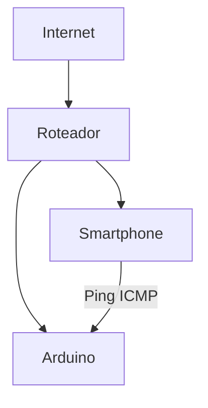
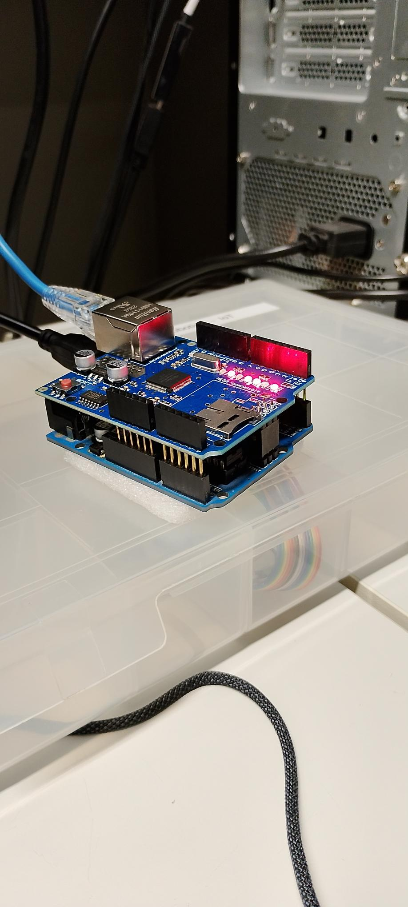
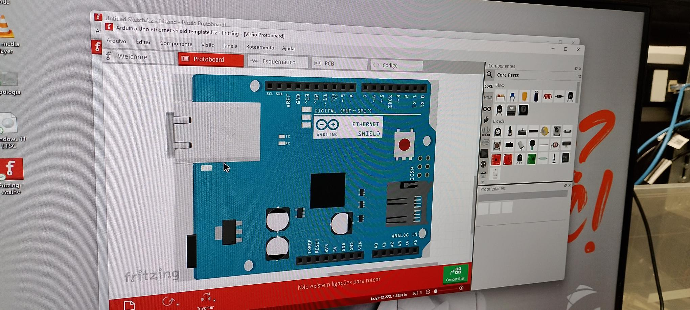
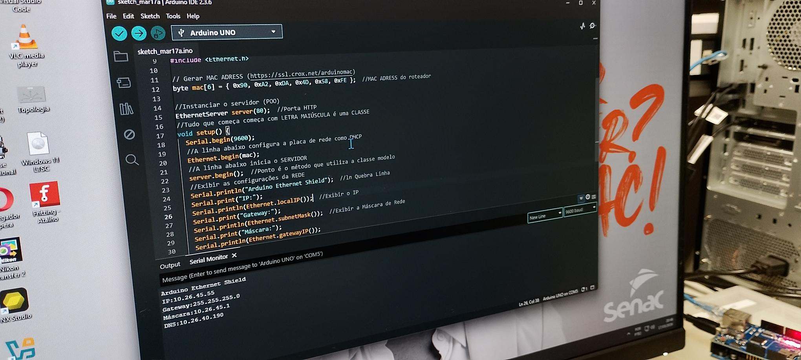

# IoT-Internet-das-Coisas

Alunos: Sara Oliveria, Nicolas Lopes e Anna Júlia

Professor: José de Assis

Data: 17/03/2026

---

# 📡 IoT com Arduino Ethernet - Monitoramento de Rede

Projeto de Internet das Coisas (IoT) utilizando Arduino com Ethernet Shield para comunicação em rede local e testes de conectividade.

---

## Objetivo:

Estabelecer comunicação entre um dispositivo Arduino e a rede local, permitindo:

- Obter endereço IP
- Responder requisições HTTP
- Validar conectividade via Ping

---

## Componentes Utilizados:

- Arduino UNO  
- Ethernet Shield (W5100)  
- Roteador  
- 2 Cabos Ethernet  
- Smartphone com aplicativo de Ping  

---

## Topologia da Rede:

---

## Testes Realizados:

Foi utilizado um aplicativo de ping para testar a comunicação:

- Respostas recebidas com sucesso  
- Latência média: **3ms ~ 13ms**  
- Comunicação estável  

---

## Segurança:

- Comunicação local sem autenticação  
- Dispositivo vulnerável se exposto (ex: DMZ)  
- Firewall do roteador controla acessos externos  

---

## Imagens do Projeto

### Hardware

### Montagem (Fritzing)

### Código em execução

### Teste de Ping

---

## Melhorias Futuras

- Adicionar sensores IoT  
- Criar dashboard web  
- Implementar autenticação  
- Integração com API  

